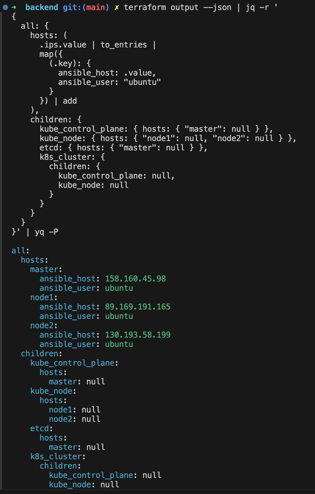
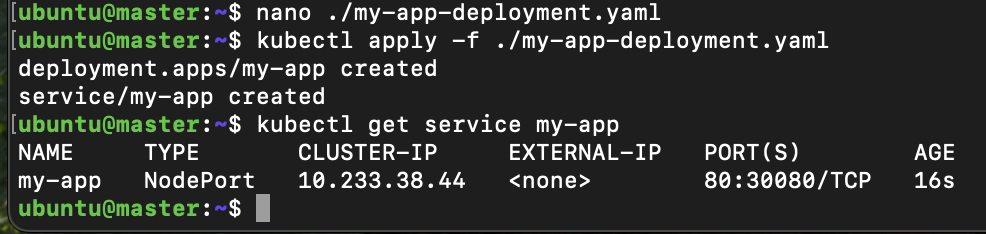

    Скрипт `auto.sh` автоматически разворачивает инфраструктуру, генерирует inventory, устанавливает kubernetes с помощью kubespray и мониторинг с помощью helm.

    Необходимо только создать `personal.auto.tfvars` в `terraform/for_backend` и `terraform/backend`, где указать `cloud_id`, `folder_id` и `token`.

    Для генерации inventory для ansible используются jq и yq, убедитесь что они установлены.

## Создание облачной инфраструктуры

1. [Создание сервисного аккаунта с правами записи, бакета](./terraform/for_backend/)

    Создает сервисный аккаунт с правами на запись, и бакет для хранения state-файла. Возвращает access_key и secret_key для бэкенда.

    <details>
      <summary> <code>terraform init && terraform apply --auto-approve </code></summary>

        ➜  diplom git:(main) ✗ cd ./terraform/for_backend 
        ➜  for_backend git:(main) ✗ terraform init && terraform apply --auto-approve
        Initializing the backend...
        Initializing provider plugins...
        - Finding latest version of yandex-cloud/yandex...
        - Installing yandex-cloud/yandex v0.147.0...
        - Installed yandex-cloud/yandex v0.147.0 (unauthenticated)
        Terraform has created a lock file .terraform.lock.hcl to record the provider
        selections it made above. Include this file in your version control repository
        so that Terraform can guarantee to make the same selections by default when
        you run "terraform init" in the future.
        
        Terraform has been successfully initialized!
        
        You may now begin working with Terraform. Try running "terraform plan" to see
        any changes that are required for your infrastructure. All Terraform commands
        should now work.
        
        If you ever set or change modules or backend configuration for Terraform,
        rerun this command to reinitialize your working directory. If you forget, other
        commands will detect it and remind you to do so if necessary.
        
        Terraform used the selected providers to generate the following execution plan.         Resource actions are indicated with the following symbols:
          + create
        
        Terraform will perform the following actions:
        
          # yandex_iam_service_account.sa will be created
          + resource "yandex_iam_service_account" "sa" {
              + created_at  = (known after apply)
              + description = "diplom-sa"
              + folder_id   = (sensitive value)
              + id          = (known after apply)
              + name        = "diplom"
            }
        
          # yandex_iam_service_account_static_access_key.sa-static-key will be created
          + resource "yandex_iam_service_account_static_access_key" "sa-static-key" {
              + access_key                   = (known after apply)
              + created_at                   = (known after apply)
              + description                  = "static access key for object storage"
              + encrypted_secret_key         = (known after apply)
              + id                           = (known after apply)
              + key_fingerprint              = (known after apply)
              + output_to_lockbox_version_id = (known after apply)
              + secret_key                   = (sensitive value)
              + service_account_id           = (known after apply)
            }
        
          # yandex_resourcemanager_folder_iam_member.sa-editor will be created
          + resource "yandex_resourcemanager_folder_iam_member" "sa-editor" {
              + folder_id = (sensitive value)
              + id        = (known after apply)
              + member    = (known after apply)
              + role      = "editor"
            }
        
          # yandex_storage_bucket.diplom_bucket will be created
          + resource "yandex_storage_bucket" "diplom_bucket" {
              + access_key            = (known after apply)
              + acl                   = (known after apply)
              + bucket                = "kirsanov-diplom-bucket"
              + bucket_domain_name    = (known after apply)
              + default_storage_class = (known after apply)
              + folder_id             = (known after apply)
              + force_destroy         = false
              + id                    = (known after apply)
              + policy                = (known after apply)
              + secret_key            = (sensitive value)
              + website_domain        = (known after apply)
              + website_endpoint      = (known after apply)
        
              + anonymous_access_flags (known after apply)
        
              + grant (known after apply)
        
              + versioning (known after apply)
            }
        
        Plan: 4 to add, 0 to change, 0 to destroy.
        
        Changes to Outputs:
          + access_key = (sensitive value)
          + secret_key = (sensitive value)
        yandex_iam_service_account.sa: Creating...
        yandex_iam_service_account.sa: Creation complete after 2s [id=ajec9m12o0oe7kecnbeb]
        yandex_iam_service_account_static_access_key.sa-static-key: Creating...
        yandex_resourcemanager_folder_iam_member.sa-editor: Creating...
        yandex_iam_service_account_static_access_key.sa-static-key: Creation complete after         2s [id=aje7kiijgg7g7c2l4kf2]
        yandex_storage_bucket.diplom_bucket: Creating...
        yandex_resourcemanager_folder_iam_member.sa-editor: Creation complete after 3s         [id=b1g65ggbv0fmdj4bp782/editor/serviceAccount:ajec9m12o0oe7kecnbeb]
        yandex_storage_bucket.diplom_bucket: Creation complete after 3s         [id=kirsanov-diplom-bucket]
        
        Apply complete! Resources: 4 added, 0 changed, 0 destroyed.
        
        Outputs:
        
        access_key = <sensitive>
        secret_key = <sensitive>
    </details>

    <details>
      <summary> Скриншоты </summary>
      
      Сервисный аккаунт
      

      Бакет
      

    </details>

    Чтобы не светить ключи экспортируем их в окружение:

    ```
    export ACCESS_KEY="$(terraform output --json | jq -r ".access_key.value")"
    export SECRET_KEY="$(terraform output --json | jq -r ".secret_key.value")"

    ```

2. [Подготовьте backend для Terraform](./terraform/for_backend/)

    Всё подготовлено в п. 1.

3. [Создайте конфигурацию Terrafrom, используя созданный бакет ранее как бекенд для хранения стейт файла.](./terraform/backend/providers.tf)

    При инициализации передаем ключи как переменные окружения:

    <details>
      <summary> <code>terraform init -backend-config="access_key=$ACCESS_KEY" -backend-config="secret_key=$SECRET_KEY" -reconfigure </code></summary>
    
        backend git:(main) ✗ terraform init -backend-config="access_key=$ACCESS_KEY" -backend-config="secret_key=$SECRET_KEY" -reconfigure
        Initializing the backend...

        Successfully configured the backend "s3"! Terraform will automatically
        use this backend unless the backend configuration changes.
        Initializing provider plugins...
        - Finding latest version of yandex-cloud/yandex...
        - Installing yandex-cloud/yandex v0.147.0...
        - Installed yandex-cloud/yandex v0.147.0 (unauthenticated)
        Terraform has created a lock file .terraform.lock.hcl to record the provider
        selections it made above. Include this file in your version control repository
        so that Terraform can guarantee to make the same selections by default when
        you run "terraform init" in the future.

        Terraform has been successfully initialized!

        You may now begin working with Terraform. Try running "terraform plan" to see
        any changes that are required for your infrastructure. All Terraform commands
        should now work.

        If you ever set or change modules or backend configuration for Terraform,
        rerun this command to reinitialize your working directory. If you forget, other
        commands will detect it and remind you to do so if necessary.
    </details>


4. [Создайте VPC с подсетями в разных зонах доступности.](./terraform/backend/vpc.tf)

    Создаем 3 подсети и по одной VPC в каждой из них.

    <details>
      <summary> Скриншоты </summary>

      `terraform apply --auto-approve`
      

      State-file

      

      VM`s

      
    </details>

5. Убедитесь, что теперь вы можете выполнить команды terraform destroy и terraform apply без дополнительных ручных действий.

    `terraform destroy` и `terraform apply` нормально проходят с ключом `--auto-approve`.


## Создание Kubernetes кластера

Используем `kubespray`.

В `ansible/kubespray/inventory/diplom/group_vars/k8s_cluster/addons.yml` включим `helm_enabled: true` и `ingress_nginx_enabled: true`

Для доступа к кластеру извне, нужно сгенерировать сертификаты. Для этого в `ansible/kubespray/inventory/diplom/group_vars/k8s_cluster/k8s-cluster.yml` указываем IP мастер-ноды в `supplementary_addresses_in_ssl_keys []`.

Так же, нужно сгенерировать inventory-файл, для этого буду использовать `jq` и `yq`:
<details>
  <summary> Генерация inventory </summary>
    
    terraform output --json | jq -r '
      {
        all: {
          hosts: (
            .ips.value | to_entries |
            map({
              (.key): {
                ansible_host: .value,
                ansible_user: "ubuntu"
              }
            }) | add
          ),
          children: {
            kube_control_plane: { hosts: { "master": null } },
            kube_node: { hosts: { "node1": null, "node2": null } },
            etcd: { hosts: { "master": null } },
            k8s_cluster: {
              children: {
                kube_control_plane: null,
                kube_node: null
              }
            }
          }
        }
      }' | yq -P > ../../ansible/kubespray/inventory/diplom/inventory.yaml

</details>

<details>
  <summary> Скриншот генерации </summary>
    

</details>


<details>
  <summary><code>ansible-playbook -i ./inventory/diplom/inventory.yaml ./cluster.yml -b</code></summary>


 </details> 


Kubespray почему-то в первый раз затыкается на стадии `[kubernetes/preinstall : Stop if cgroups are not enabled on nodes]`, но со второго захода отрабатывает нормально.

После развертывания кластера на мастер-ноде нужно скопировать конфигурацию в `~/.kube`:

    mkdir -p ~/.kube
    sudo cp -i /etc/kubernetes/admin.conf ~/.kube/config
    sudo chown $(id -u):$(id -g) ~/.kube/config

И меняем IP в `./.kube/config` с 127.0.0.1 на публичный адрес машины.

<details>
  <summary><code>cat ./.kube/config</code></summary>


 </details> 

<details>
  <summary><code>kubectl get pods --all-namespaces и kubectl get nodes</code></summary>

        ubuntu@master:~$ kubectl get pods --all-namespaces 
        NAMESPACE       NAME                                       READY   STATUS    RESTARTS       AGE
        ingress-nginx   ingress-nginx-controller-r2kzk             1/1     Running   0              118s
        ingress-nginx   ingress-nginx-controller-s9kzl             1/1     Running   0              118s
        kube-system     calico-kube-controllers-85c5d47cb8-kjlcx   1/1     Running   0              2m20s
        kube-system     calico-node-2krxv                          1/1     Running   0              2m47s
        kube-system     calico-node-6c6k9                          1/1     Running   0              2m47s
        kube-system     calico-node-gmfkh                          1/1     Running   0              2m47s
        kube-system     coredns-84668b4497-67h7h                   1/1     Running   0              107s
        kube-system     coredns-84668b4497-kc8xz                   1/1     Running   0              113s
        kube-system     dns-autoscaler-56cb45595c-9m6hb            1/1     Running   0              112s
        kube-system     kube-apiserver-master                      1/1     Running   0              4m26s
        kube-system     kube-controller-manager-master             1/1     Running   2 (4m9s ago)   4m28s
        kube-system     kube-proxy-9nt5m                           1/1     Running   0              3m22s
        kube-system     kube-proxy-jrltn                           1/1     Running   0              3m22s
        kube-system     kube-proxy-plfvl                           1/1     Running   0              3m22s
        kube-system     kube-scheduler-master                      1/1     Running   1              4m26s
        kube-system     nginx-proxy-node1                          1/1     Running   0              3m24s
        kube-system     nginx-proxy-node2                          1/1     Running   0              3m25s
        kube-system     nodelocaldns-glg8r                         1/1     Running   0              109s
        kube-system     nodelocaldns-l4fg8                         1/1     Running   0              108s
        kube-system     nodelocaldns-wmd64                         1/1     Running   0              108s
        ubuntu@master:~$ kubectl get nodes
        NAME     STATUS   ROLES           AGE     VERSION
        master   Ready    control-plane   5m48s   v1.33.2
        node1    Ready    <none>          4m45s   v1.33.2
        node2    Ready    <none>          4m45s   v1.33.2


 </details> 


## Создание тестового приложения

1. [Репозиторий](https://github.com/kirs-kirill/diplom-app) с тестовым приложением. [Dockerfile](https://github.com/kirs-kirill/diplom-app/blob/main/dockerfile).
2. [Dockerhub](https://hub.docker.com/repository/docker/kirskirill/diplomapp/) с собранным образом приложения.

## Подготовка cистемы мониторинга и деплой приложения

Добавим репозиторий в helm":

    helm repo add prometheus-community https://prometheus-community.github.io/helm-charts
    helm repo update

Установим мониторинг

    helm install stable prometheus-community/kube-prometheus-stack

Немного удобства:

    export KUBE_EDITOR=nano

Поправим тип сервиса на `NodePort`

    kubectl edit svc stable-kube-prometheus-sta-prometheus
    kubectl edit svc stable-grafana

<details>
<summary> <code>kubectl get services</code> </summary>


</details>

<details>
<summary> Grafana dashboard </summary>


</details>

<details>
<summary> Prometheus </summary>


</details>

[Файл деплоймента тестового приложения](./kuber/my-app-deploy.yaml)

<details>
<summary> My-app </summary>


</details>

<details>
<summary> Web page </summary>


</details>

## Установка и настройка CI/CD

Буду использовать Github Actions.

Пайплайн для [коммитов](https://github.com/kirs-kirill/diplom-app/blob/main/.github/workflows/on_push.yml)

Пайплайн для [тегов](https://github.com/kirs-kirill/diplom-app/blob/main/.github/workflows/on_tag.yml)

Для деплоя на кластер kubernetes будет использоваться простая отправка `kubectl set image`.

Для авторизации на кластере используется вывод `cat ./.kube/config | base64`, записанный в secrets.

При коммитах срабатывает пайплайн и отправляет собранный образ в Docker Hub, вместо тега используется хэш коммита:

<details>
<summary> Скриншот сборки в очереди и образа в хабе </summary>


</details>


При создании тега образу присваивается номер тега из гитхаба и тег latest:

<details>
<summary> Скриншот сборки в очереди и образа в хабе </summary>


</details>

После прохождения пайплайна изменился тег образа в класетере и изменилась тестовая страница:

<details>
<summary> Скриншот сборки в очереди и образа в хабе </summary>


</details>


Понимаю, что деплой через kubectl - это так себе практика.